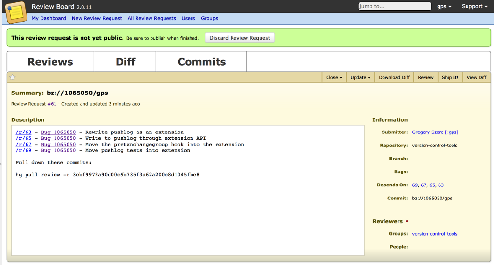
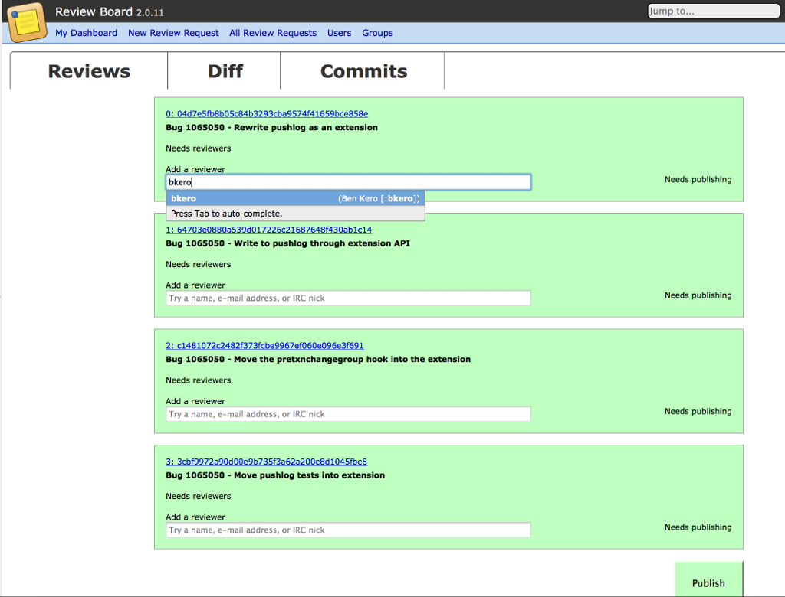
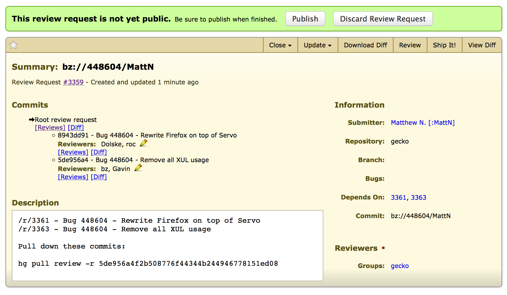

.. _mozreview_reviewboard:

=============================
Interacting with Review Board
=============================

The web interface of MozReview is powered by
`Review Board <https://www.reviewboard.org/>`_. This article will talk a
little about how Review Board works and how we've customized it for
MozReview.

How Review Board Works
======================

Before we go on to describe how to use Review Board, it is important
to have a brief understanding of how Review Board works.

For the patient, a read of the
`Review Board User Guide <https://www.reviewboard.org/docs/manual/2.0/users/>`_
is recommended.

For the impatient, some terminology. Note that some of these terms
are specific to MozReview.

review request
   A request to review a single patch/diff/commit
review
   Responses to a review request
issue
   A component of a review that is explicitly tracked as part of the
   review request
review request series
   A collection of review requests all belonging to the same logical
   group
parent review request
   For review request series, the review request that tracks the
   overall state of the series. This is also known as the root review request.
draft
   Refers to a state review requests or reviews can be in where content
   is not publicly visible and is only available to the person who created
   it. All review requests and reviews start in the draft state by default.
publishing
   The act of taking a draft review request or draft review and marking
   it as public, making it visible to everybody
ship it
   This is the term used for *granting review* or *r+* in Bugzilla
   terminology.
review id
   A unique identifier identifying a review request series. This is
   commonly derived from a bug number and username.

.. _mozreview_reviewboard_publishing_commits:

Publishing Commits
==================

When you push commits to the review repository, review requests are
created in Review Board. As a refresher::

  $ hg push review
  pushing to ssh://reviewboard-hg.mozilla.org/gecko
  searching for changes
  remote: adding changesets
  remote: adding manifests
  remote: adding file changes
  remote: added 2 changesets with 2 changes to 2 files (+1 heads)
  remote: Trying to insert into pushlog.
  remote: Please do not interrupt...
  remote: Inserted into the pushlog db successfully.
  submitting 2 changesets for review

  changeset:  227233:8943dd91f4c0
  summary:    Bug 448604 - Rewrite Firefox on top of Servo
  review:     https://reviewboard.mozilla.org/r/3361 (pending)

  changeset:  227234:5de956a4f2b5
  summary:    Bug 448604 - Remove all XUL usage
  review:     https://reviewboard.mozilla.org/r/3363 (pending)

  review id:  bz://448604/MattN
  review url: https://reviewboard.mozilla.org/r/3359 (pending)
  (visit review url to publish this review request so others can see it)

The *pending* in the output says that the review requests are in an
unpublished *draft* state. In other words, only you can see the content
that has been uploaded to Review Board.

The first thing you should do is follow the final URL in the output -
the *review url*. You should see a page like the following:

This is the parent (aka. root) review request. It is a special review request
that manages the state of all the *children* review requests.

The metadata on the parent review request is derived from the content of
commits you've pushed for review. You can see a list of commits and
their summary lines that are part of the review.

.. note::

   There is a
   `proposal <https://bugzilla.mozilla.org/show_bug.cgi?id=1039679>`_
   to eliminate the parent review request for reviews only consisting of
   a single commit.

To publish the collection of review requests, you'll want to assign reviewers.

Each commit has **Reviewers** line that shows the reviewer(s) for the commit.

To edit reviewers, click the pencil icon to display an input box. Typing into
the input box will display results from Bugzilla's and Review Board's shared
user database. Here is what that looks like:

.. tip::

   The easiest way to find a reviewer is by IRC nickname. You should
   not need to type the leading colon that exists in Bugzilla.

Once you've selected the reviewers for a commit, click **OK** to stop editing
the field.

After you've selected a reviewer for each commit, your parent review request
will look something like the following:

At this time, you'll want to click the **Publish** button on the green
notification bar. This will start the process of publishing the reviews in
Review Board and updating Bugzilla to reflect that a review is
requested.

Reviewing Code
==============

So you've been asked to review something on Review Board. You've come
to the right place to learn.

Mozilla hasn't customized the review interface of Review Board
significantly. So, the
`Review Board User Guide <https://www.reviewboard.org/docs/manual/2.0/users/>`_,
particularly the section on
`Reviewing <https://www.reviewboard.org/docs/manual/2.0/users/reviews/>`_,
is almost completely applicable to MozReview!

We **highly** recommend reading the
`Reviewing <https://www.reviewboard.org/docs/manual/2.0/users/reviews/>`_
section of the Review Board User Guide before conducting review. When
reading, you may want to pay attention to the following, which may be
new concepts if you are coming from Bugzilla code reviews:

Advanced Diff Viewer and Commenting
   The diff viewing and commenting mechanism in Review Board is much
   more advanced compared to Bugzilla/Splinter.

   If the lines of context in a review are not sufficient, you can
   expand context right from the review interface (it just fetches the
   data from the underlying repository you pushed the commits too).

   Intra-line diffs are supported. This means if you only change a
   single character or line, that is clearly indicated.

   Whitespace differences can be shown or hidden dynamically from the
   interface.

   Review comments can be set over multiple lines, allowing reviewers
   to be clearer about where the comment applies.

   Interdiff (showing the diff between multiple versions of the diff)
   works.

`Issue Tracking <https://www.reviewboard.org/docs/manual/2.0/users/reviews/issue-tracking/>`_
   When writing comments on reviews, Review Board allows you to open an
   *Issue*.

   Issues are important comments that are explcitly tracked by
   Review Board.

   When you view a review request, a table of issues is presented. This
   allows reviewer and code author to track the progress of a review over
   multiple iterations.

`Markdown <https://www.reviewboard.org/docs/manual/2.0/users/markdown/>`_
   Review Board supports Markdown in many of its multi-line text fields.
   This includes review comments. Use the power responsibly.

Drafts and Published Reviews
   Review comments are in an unpublished *draft* state by default. You
   must explicitly click a **Publish Review** button for your review to
   be visible by others.

Conversion to Bugzilla Comments
   When reviews are published, their content is converted to text and
   posted to Bugzilla as a comment.

   (There is talk of changing this behavior because capturing the rich
   review interface in Bugzilla comments can be challenging and appears
   to offer little value over just going to Review Board and looking at
   the original comments there.)

Granting Review via Ship It
   There is a **Ship It** checkbox in the reviewer interface. This is
   Review Board's way of granting review (``r+`` in Bugzilla
   terminology).

   There is currently no equivalent to ``feedback+`` or cancelling
   reviews. This workflow is still being discussed.

Two Types of Ship Its
---------------------

A **Ship It** on a per-commit review request behaves different from a
**Ship It** on a parent review request.

Since we only create a Bugzilla ``review?`` attachments/flags for the
parent review request, setting **Ship It** on a per-commit review will
not impact Bugzilla flags.

For a ``review+`` flag to be set in Bugzilla, a **Ship It** review must
be conducted on the parent review request. This means that you may have
to grant an extra **Ship It** review in addition to granting **Ship It**
on the individual commits.

.. note::

   The behavior of **Ship It** and how we manage review requests in
   Bugzilla is a bit clumsy. It is very likely the workflow will change
   over time. Proposals are very welcome.
