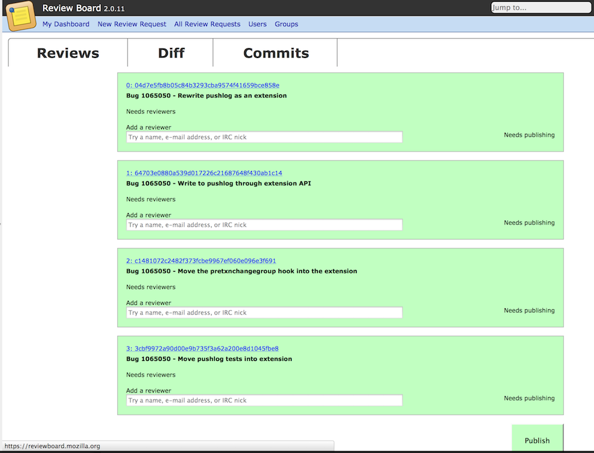

.. _mozreview_reviewboard:

=============================
Interacting with Review Board
=============================

The web interface of MozReview is powered by
`Review Board <https://www.reviewboard.org/>`_. This article will talk a
little about how Review Board works and how we've customized it for
MozReview.

How Review Board Works
======================

Before we go on to describe how to use Review Board, it is important
to have a brief understanding of how Review Board works.

For the patient, a read of the
`Review Board User Guide <https://www.reviewboard.org/docs/manual/2.0/users/>`_
is recommended.

For the impatient, some terminology. Note that some of these terms
are specific to MozReview.

review request
   A request to review a single patch/diff/commit
review
   Responses to a review request
issue
   A component of a review that is explicitly tracked as part of the
   review request
review request series
   A collection of review requests all belonging to the same logical
   group
parent review request
   For review request series, the review request that tracks the
   overall state of the series
draft
   Refers to a state review requests or reviews can be in where content
   is not publicly visible and is only available to the person who created
   it. All review requests and reviews start in the draft state by default.
publishing
   The act of taking a draft review request or draft review and marking
   it as public, making it visible to everybody
ship it
   This is the term used for *granting review* or *r+* in Bugzilla
   terminology.
review id
   A unique identifier identifying a review request series. This is
   commonly derived from a bug number and username.

.. _mozreview_reviewboard_publishing_commits:

Publishing Commits
==================

When you push commits to the review repository, review requests are
created in Review Board. As a refresher::

  $ hg push review
  pushing to ssh://reviewboard-hg.mozilla.org/version-control-tools
  searching for changes
  remote: adding changesets
  remote: adding manifests
  remote: adding file changes
  remote: added 4 changesets with 8 changes to 4 files (+1 heads)
  submitting 4 changesets for review

  changeset:  4615:04d7e5fb8b05
  summary:    Bug 1065050 - Rewrite pushlog as an extension
  review:     https://reviewboard.mozilla.org/r/63 (pending)

  changeset:  4616:64703e0880a5
  summary:    Bug 1065050 - Write to pushlog through extension API
  review:     https://reviewboard.mozilla.org/r/65 (pending)

  changeset:  4617:c1481072c248
  summary:    Bug 1065050 - Move the pretxnchangegroup hook into the extension
  review:     https://reviewboard.mozilla.org/r/67 (pending)

  changeset:  4618:3cbf9972a90d
  summary:    Bug 1065050 - Move pushlog tests into extension
  review:     https://reviewboard.mozilla.org/r/69 (pending)

  review id:  bz://1065050/gps
  review url: https://reviewboard.mozilla.org/r/61 (pending)
  (visit review url to publish this review request so others can see it)

The *pending* in the output says that the review requests are in an
unpublished *draft* state. In other words, only you can see the content
that has been uploaded to Review Board.

The first thing you should do is follow the final URL in the output -
the *review url*. You should see a page like the following:

.. image:: parent-unpublished.png

This is the parent review request. It is a special review request that
manages the state of all the *children* review requests.

The metadata on the parent review request is derived from the content of
commits you've pushed for review. You can see a list of commits and
their summary lines that are part of the review.

.. note::

   There is a
   `proposal <https://bugzilla.mozilla.org/show_bug.cgi?id=1039679>`_
   to eliminate the parent review request for reviews only consisting of
   a single commit.

To publish the collection of review requests, you'll want to click on
the **Commits** tab near the top right. When that page loads, it looks
something like the following:

You will see a listing of every commit in the review along with basic
metadata about that commit.

Each commit has an input box assigned to it. This input box is used to
select the reviewer for the commit.

Typing into the input box will display results from Bugzilla's and
Review Board's shared user database. Here is what that looks like:

.. image:: select-reviewer.png

.. tip::

   The easiest way to find a reviewer is by IRC nickname. You should
   not need to type the leading colon that exists in Bugzilla.

After you've selected a reviewer for each commit, your **Commits** tab
will look something like the following:

.. image:: publish.png

At this time, you'll want to click the giant **Publish** button in the
bottom right. This will start the process of publishing the reviews in
Review Board and updating Bugzilla to reflect that a review is
requested.

.. warning::

   The MozReview maintainers don't like the current implementation of
   the **Commits** tab. We know the interface isn't intuitive. It is
   implemented the way it is because that was easiest.

   There are
   `plans <https://bugzilla.mozilla.org/show_bug.cgi?id=1064111>`_
   to improve the UX situation. If you have web design skills, we
   love patches.

Review Workflow
===============

We need to write this documentation. Until then, read the aforementioned
Review Board User Guide or go to https://reviewboard.mozilla.org/ and
tell us what parts aren't obvious.
